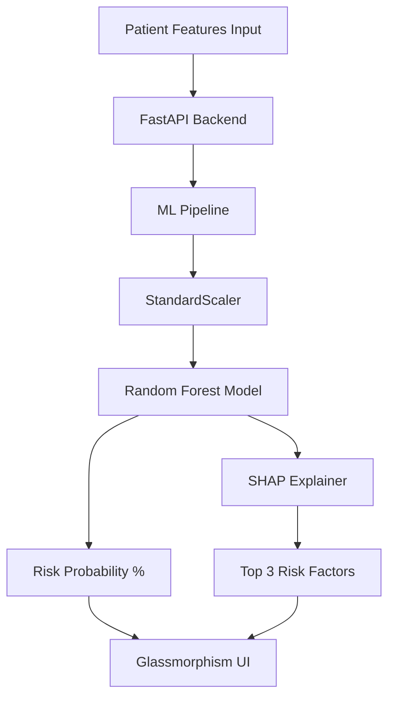

# HeartSync AI: Heart Disease Risk Predictor


**HeartSync AI** is a minimalist, high-impact machine learning application designed to predict the probability of heart disease in patients. Beyond simple prediction, it leverages **SHAP (SHapley Additive exPlanations)** to provide transparent, human-readable explanations of *why* a specific risk level was calculated.

---

## 🔥 Key Features

- **Predictive Intelligence**: Powered by a Random Forest Classifier trained on the UCI Heart Disease Dataset.
- **Explainable AI (XAI)**: Highlights the top 3 physiological factors (e.g., High Cholesterol, Low Heart Rate) influencing each prediction using SHAP values.
- **Premium UI**: A stunning single-page "Glassmorphism" interface built with Vanilla CSS for maximum performance and a modern aesthetic.
- **Cloud Native**: Fully optimized for **Vercel Serverless Functions** for effortless deployment.

---

## 🏗️ Architecture



---

## 🛠️ Tech Stack

- **Frontend**: HTML5, Vanilla CSS3 (Glassmorphism), JavaScript (ES6+).
- **Backend**: FastAPI, Pydantic, Uvicorn.
- **Machine Learning**: Pandas, Scikit-Learn, NumPy.
- **Explainability**: SHAP (TreeExplainer).
- **Deployment**: Vercel (Serverless Functions).

---

## 🚀 Getting Started

### Local Setup

1. **Clone the repository**:
   ```bash
   git clone https://github.com/Mukul7Raj/Heart-Sync.git
   cd Heart-Sync
   ```

2. **Install dependencies**:
   ```bash
   pip install -r requirements.txt
   ```

3. **Run the application**:
   ```bash
   python main_app.py
   ```
   Access the UI by opening `index.html` in your browser.

### Cloud Deployment (Vercel)

The project is pre-configured with `vercel.json` and a serverless entry point at `api/index.py`. 
1. Install Vercel CLI: `npm i -g vercel`
2. Run `vercel` in the root directory.

---

## 📊 Dataset Detail
The model is trained on the **UCI Heart Disease Dataset** (Cleveland database). It considers 13 patient attributes including blood pressure, serum cholesterol, and maximum heart rate to determine the target risk.

---

## 👨‍💻 Author
**Mukul Raj**
- GitHub: [@Mukul7Raj](https://github.com/Mukul7Raj)
